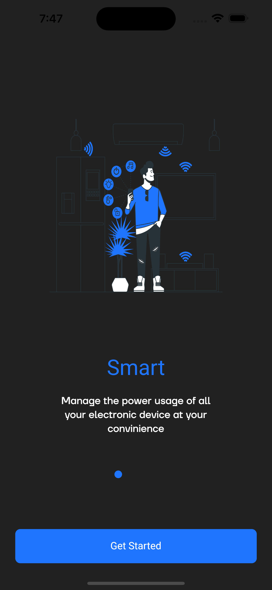
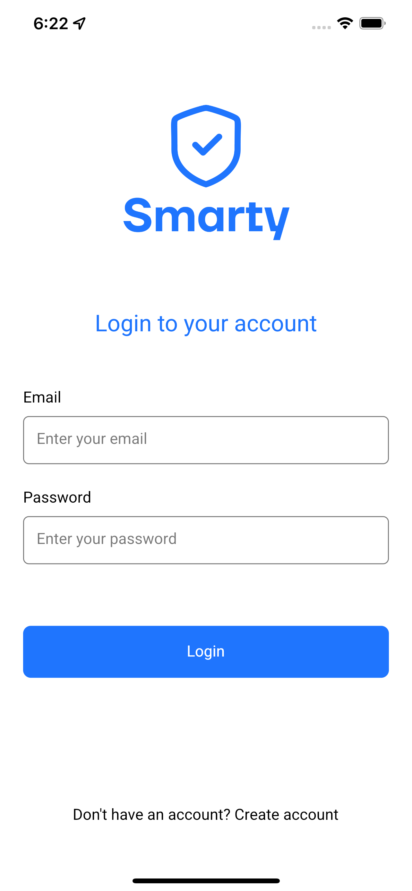
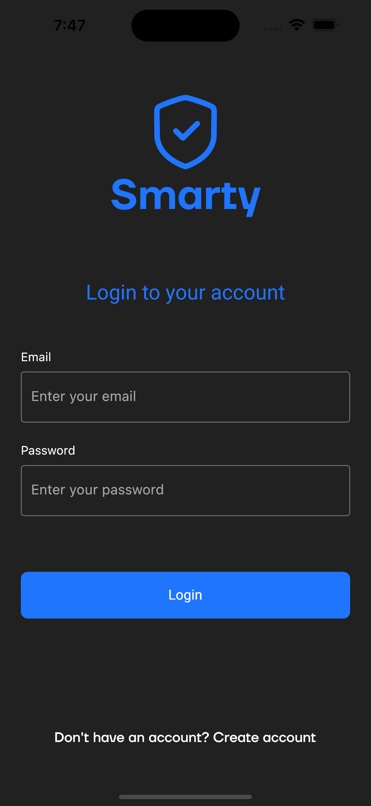
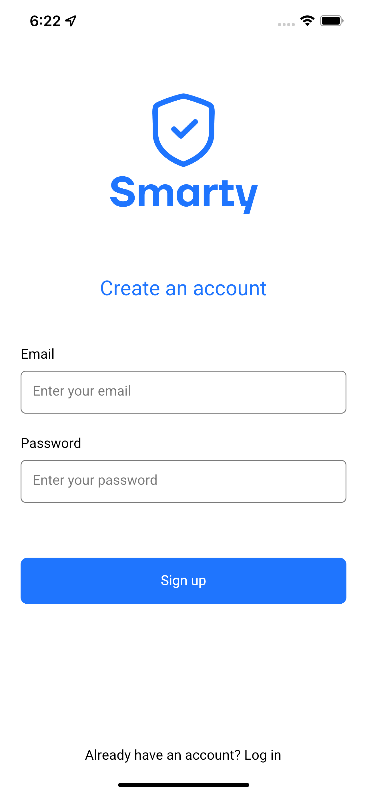
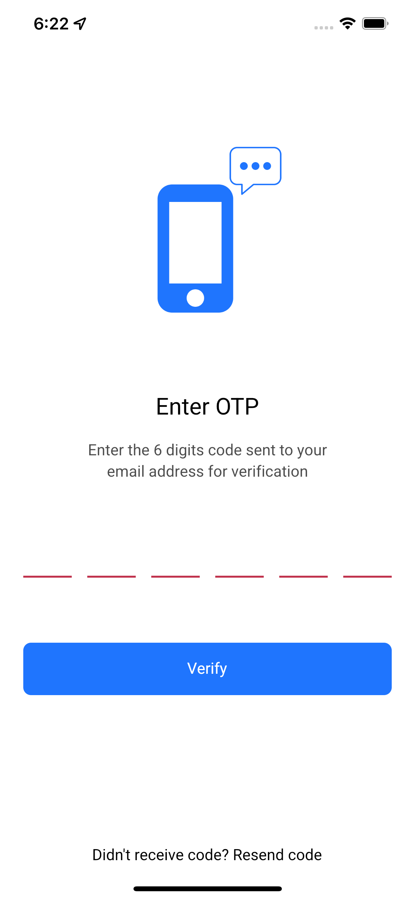
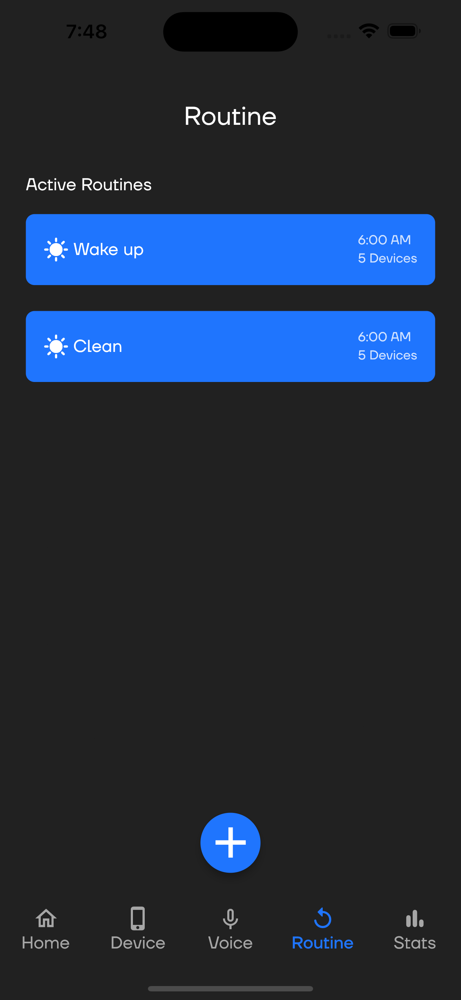

# Home Automation Control System

## Description
The **Home Automation Control System** is a comprehensive mobile application designed to allow users to manage and monitor various smart home devices. Built with Flutter, this system enhances convenience, security, and energy efficiency in the user's home environment.

## Key Features

- **User Authentication and Profile Management:** Secure login with role-based access control.
- **Device Control:** Manage smart devices such as lights, thermostats, security cameras, and door locks.
- **Real-time Monitoring:** View live feeds from security cameras and receive status updates from sensors.
- **Notifications and Alerts:** Receive push notifications for critical events like security breaches or smoke detection.
- **Energy Management:** Monitor energy consumption and get recommendations to optimize usage.
- **Voice Control Integration:** Compatible with Amazon Alexa and Google Assistant for voice command functionality.
- **Mobile Access:** Accessible via a responsive mobile app on both Android and iOS.

## Tech Stack and Integrations

## Tech Stack Badges

### Mobile App Development
- **Frontend:** Flutter for a dynamic and responsive user interface.
- **Backend Integration:** RESTful APIs for seamless communication with backend services.
- **Authentication:** Firebase for real-time database functionality and secure user authentication.
- **Real-time Communication:** WebSocket for instant updates and communication between the mobile app and the backend.

## My Contributions

### User Interface Development
- **Flutter Development:** Created a dynamic and responsive mobile app using Flutter, ensuring a consistent user experience across Android and iOS.
- **Component Design:** Designed and implemented components for device control, real-time monitoring, and user management.
- **Visual Design:** Used Flutter’s widgets to build an aesthetically pleasing and user-friendly interface.

### Real-time Data Integration
- **WebSocket Integration:** Enabled real-time communication for immediate status updates of devices and sensors.

### User Authentication
- **Firebase Integration:** Implemented secure login and user management using Firebase authentication services.

## Impact

- **Enhanced User Experience:** Developed an intuitive and responsive interface, simplifying the management of smart home devices.
- **Improved User Engagement:** Designed a visually appealing UI, leading to increased user satisfaction and engagement.
- **Real-time Interaction:** Provided immediate feedback and control through real-time data updates.
- **Accessibility:** Ensured the app is fully accessible on mobile devices, allowing users to control their home environment from anywhere.

## Snapshots

| Light Theme | Dark Theme |
|-------------|------------|
|  |  |
|  |  |
|  |  |
|  |  |
|  |  |
|  |  |
|  |  |
|  |  |

---

